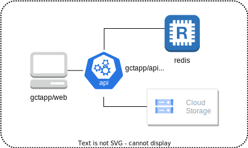

# gcp-cicd-ts-app-playground

This is a test project! 
I imagined a demo app called <span style="color:orange">@gctapp</span>.

With this project I intend to warm up my react knowledge and also to get some GCP serverless experience. Also want to learn latest best practices around npm workspaces and monorepos.

## Example app context will be: _Energy consumption optimization app._ 

### Data starting point 

Lets say, there is a complex backend that collects data from sensors and saves it in jsonlines files for each day. Further, these files will be stored timestamp-like paths in GCS Storage.

El. prices example `/prices/{year}/{month}/{day}.jsonl`:
```
{ "timestamp": 1649732400, "price": 0.12, "currency": "BGN"}
{ "timestamp": 1649736000, "price": 0.13, "currency": "BGN"}
```
El. usage example `/usage/{year}/{month}/{day}/{metering_point_id}.jsonl`
```
{ "timestamp": 1649732400, "kwh": 0.5}
{ "timestamp": 1649736000, "kwh": 0.6}
``` 

### Decoupled from backend

Even this monorepo contains `web` _and_ `api` / `core` part, we will look at all of them just as frontend, i.e the vizualization app, for the bigger complex backend that deals with sensors, collects data and so on.

### Technical design

There is a pretty straight forward path there, in which we have express API that just downloads files from GCS, and serves them to the react app. From there on, its a matter of choosing the chart libraries.

_OR, even fastest, why not just use_ [firebase](https://www.geeksforgeeks.org/how-to-get-download-link-of-uploaded-files-in-firebase-storage-in-reactjs/) without any axpress API

My experience is more in AWS, and I never used firebase before, although had the chance to extensivly use [aws amplify](https://www.bairesdev.com/blog/amplify-vs-firebase-which-one-is-best/) which seems with pretty same idea.

[AmplifyJs](https://docs.amplify.aws/) gives you the gate keys to connecting all aws backend services in your frontend app, [so I want to try](https://www.youtube.com/watch?v=SXmYUalHyYk&t=306s) out [firebase](https://firebase.google.com/) to do the same (later, when I start with multitenancy using google cloud) or, for better cloud-lock freedom - [superbase](https://supabase.com/).  

### Expanding the scope 

For our energy optimization app, obviously we want to vizualize data, but also _we may want to analyze it first_ so that we also vizualize suggestions and any other (useful notifications [TODO link possible notifications])[] . 

I could assume this analyse-suggest services are just another 'sophosticated backend' from which I only consume data(ofcourse, the correct thinking), however, then the scope of this project will shrink to a standard firebase app only ([this example](https://www.youtube.com/watch?v=zQyrwxMPm88&t=18s), but with graphics instead of chats). And I wanted to gain new knowledge, so lets re-define the example context of this project like this:

  1. various analyses of usage vs price
  2. generating suggestions (and storing the data for them somewhere)
  3. vizualizing prices/usage data realtime, once it landed (being appended to corresponding jsonline files for the current day)
  4. vizualizing any new suggestions realtime as they get produced by our suggestion-for-optimization services


__EDIT__ I had thoughts whether to use redis + firebase or redis + mongo etc.. Or only redis for the initial POC. _Redis Enterprise has a huge progress_, and now it is being used as a central event bus, in reactive micro service architectures. Basically you get all in one: (functionalities of Kafka and the app-synchronization of fire base or dynamodb, if you like), with litle maintanence and configuration. 

_So I will focus only on redis, ofcourse thinking of some cold storage/backups_

Insipired by this talk: 

[](https://www.youtube.com/watch?v=odhL_bP9XTQ)


You are here                              | You want to reach here
---                                       | ---
 | 


So the `ServiceN` we want it to be one of our real-time data analysers, and data output from it to be pushed to react app using redis pub/sub and server side events in the react app (without helpers from firebase/superbase)

How to use this monorepo
---
download and install dependencies (`git clone ...` && `cd && npm install`)

create a `.env` file `packages/api` with contents:

```bash
# THIS FILE IS ONLY FOR LOCAL DEVELOPMENT

PORT=8080

LOGLEVEL=debug
GCT_ENV=LOCAL

LOCAL_TESTDATA_DIRNAME=localdev_files/bucket_queries_cache
BUCKET_CACHE_DIRNAME=GCS_FILES

# NOTE the project can be explored localy without any google accout
# however if you want to reload data from GCS it will complain
BUCKET_NAME=<name of your bucket>
GOOGLE_APPLICATION_CREDENTIALS=path to the credentials json 

# NOTE if you want to access another GCP GCS Bucket from withing your test google account
# 1. you need to add a separate pair of above variables
# 2. you need to pass them as environment variables to the running countainer see .github/workflows/wf-gctappapi-dev-v2.yml
# 3. depending on the environment you want to use them, change the initialization of gcs bucket in serviceClients.ts
```

`npm run web` Starts a regular react app in dev mode, default port `3000`

`npm run build && npm run api` Starts the express API used, at port `8080`

`docker compose up redis --build -d` NOTE: since data is being stored in Redis as time series, running the api is not enough, you need local redis. This will 

[Basic documentation of endpoints in place](./Endpoints.md)


## Test for deployment in GCP Cloud Run:

`docker compose up` Images are being prepared and tested locally, ~~pending is a test deployment in GCP~~


TODOS and milestones
(_Disclaimer:_ Im just starting with this, so milestones may change drasticly)

#### Basic CICD  

- Deployment of 2 images in Google Cloud Run
    - gctapp/web (react, served with nginx)
    - gctapp/api (express)
- CICD pipeline: Google actions + GCP Cloud Run

__update__:  There are Github worklfow actions for the `dev` branch (for now only), which, upon commits in respective places will trigger a redeployment of API or WEB

#### Project structure and tech stack

- pure npm monorepo (without lerna / nx)
- redis + Firebase (Maybe later), or ~~Tick Stack + Firebase~~, oor only ~~firebase~~? Or just (__update:this choice__)Redis Enterprise in Google.
    - __DONE__~~I Reaaally wanna try out the Redis Time Series module~~
    - Research for a decent visualization library
    - Looking at Nivo
    - Also, TradingView lightweight charts are free and very good 
- tests

__update__:  With Redis [Time Series](https://redis.io/docs/stack/timeseries/), I pull data from google storage and push them to redis time series (which is also a stream, but supports for real time downsampling, i.e aggregations, transformations etc). [Nivo](https://nivo.rocks/) looks great but for huge amount of data [requires more research](https://www.influxdata.com/blog/data-visualization-reactjs-nivo-influxdb/). On the other hand [Trading View lightweight charts](https://tradingview.github.io/lightweight-charts/tutorials/how_to/two-price-scales) behaves very well with litle sonfiguration

#### Data Preparation

- ~~work 'offline' with mock data~~, then __DONE__~~Prepare Data generator~~
- webapp UX, visualizations of data in various views
- tests

__update__:  
[Basic documentation of endpoints](./Endpoints.md)
Created myself price and usage random data generator, not to have to upload files each time a new dev case is to be tested. `rebuildIndex` method can work either by downloading data from GCS or via the test data generator. I  opened myself an admin endpoint to send data generation config, for ease of manual testing:
```javascript
POST {{gct_api}}/admin/sampledata/generate
{
  "start": "2021/01/01",
  "end": "2023/03/04",
  "randValueKey": "price",
  "prefix": "prices",
  "randValueRange": [500,600],
  "additionalProps": {
    "currency": "BGN"
  },
  "tickStep": 3600000
}
```
Notes:
- you can omit `end` in which case it will always generate till current date
- for `start` you can provide a partial date, in which case it will start from 1st day/mnth, Eg:
    - `start: 2022-5` or `start: 2022/5` or `start: 2021`
- MAX 5 years of data generation allowed

#--

- implement SSE (server side events), for 
    - pushing any new price/usage data to clients
    - pushing any suggestions/notifications to clients
- Use [redis srtreams](https://redis.io/docs/data-types/streams/), and [redis Pub/Sub](https://redis.io/docs/manual/pubsub/) for event bus, and from where backend services will react and do analyses over new data

#### More Backend development

- Unblocked only after Redis Pub/Sub is ready, since we wanna do reactive architecture/ no service to service communication
- basic data analisis, ~~and endpoint exposing them as recomendations~~ And push notifications to clients
- Authentication (just basic integration with GCP Auth, no business roles etc)
- Multitenancy: Lets build a _Energy optimization SaaS_
- think of proper tenant data isolation strategy (silo, pooled, etc.)
- tests
